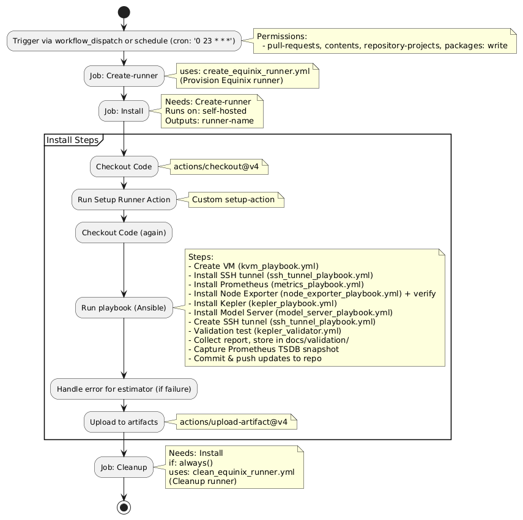

# Workflows

AWS AMI Workflow

This workflow is responsible for provisioning EC2 instance, installing Nvidia drivers and creating AMI.

AWS Metal E2E

This workflow is responsible for the end-to-end training and validation process on a single AWS instance.

Equinix k8s cluster

Equinix k8s Action

This workflow creates a Kubernetes cluster using Equinix resources and then performs a series of load/stress tests
using the kube‐burner tool, collects performance metrics from Prometheus, and finally commits the results to the
repository.

Equinix k8s Action churn check

This workflow creates a Kubernetes cluster using Equinix resources and then performs a series of load/stress tests
using the kube‐burner tool with and without “churn” (i.e. simulating workload changes), collects performance metrics
from Prometheus, and finally commits the results to the repository.

Equinix K8s Trainer

This workflow is designed to create a Kubernetes cluster on Equinix resources, prepare the cluster
for running training pipelines via Tekton, and then execute a complete training process using the Kepler Model Server.

Equinix Metal E2E

This workflow automates an end-to-end process on a single Equinix server. It provisions a runner,
sets up the environment (including installing Prometheus, Node Exporter, Kepler, and a Model Server via Ansible playbooks),
and triggers model training for a list of specified models. Afterwards, it deploys and validates the trained models,
collects performance metrics and validation reports, and finally cleans up the runner.

Equinix Metal E2E (isolated server)

This workflow automates an end-to-end training and validation process using isolated servers. It first triggers model training
using a dedicated training workflow, then provisions a runner, and finally validates the trained models by deploying them on VM
and running a series of Ansible playbooks to test the model server. Validation results(reports and logs) are collected and
committed to the repository, followed by cleanup of the server.

Equinix Metal Flow

This workflow automates the end-to-end validation process using a standalone Kepler setup. It provisions a runner, then installs
and configure the environment using several Ansible playbooks to create a VM, installs required services(SSH tunnel, Prometheus, Node Exporter, Kepler)
via Ansible playbooks and then runs validation tests. Finally, it collects validation reports and Prometheus snapshots,
updates the repository with the results, and cleans up the runner.

Equinix Metal Flow (Model Server)

This workflow validates Kepler with a Model Server on a self-hosted Equinix runner. It provisions a runner, then uses
Ansible to create a VM and install Prometheus, Node Exporter, Kepler, and the Model Server.
A validation test is then executed, artifacts (including Prometheus snapshots) are collected and committed, and the runner is cleaned up.

Equinix Metal Trainer

This workflow provisions a runner, installs necessary services (Prometheus, Node Exporter, Kepler, and a Model Server on VM)
via Ansible, then executes a model training action. Finally it cleans up the runner environment

Validator Compose

This workflow provisions a runner on Equinix(Ubuntu 22.04), executes a standalone Kepler validation via Ansible playbook
(including listing of RAPL domains, deploying Kepler on both BM and VM using compose manifests instead of systemd, running the validator tool, and capturing Prometheus snapshots),
then commits the results to the repository. Finally it cleans up the cluster

NOTE: the source for the UML can be found under [assets](./assets) directory
