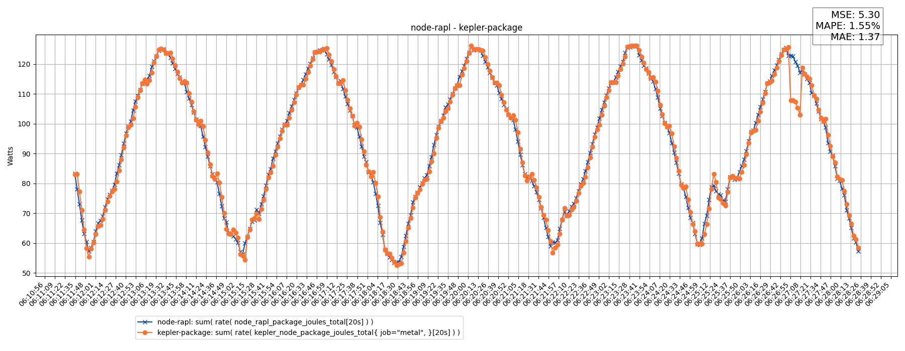
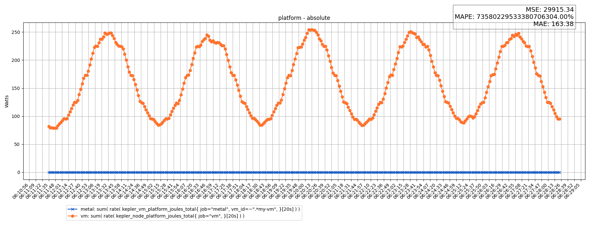
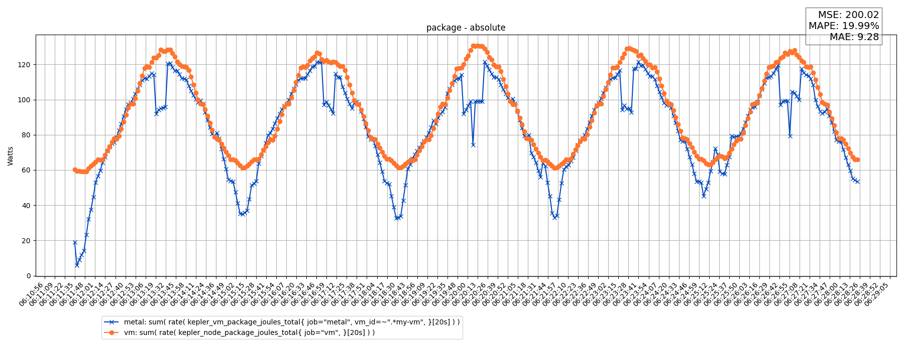
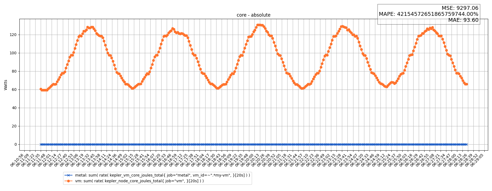
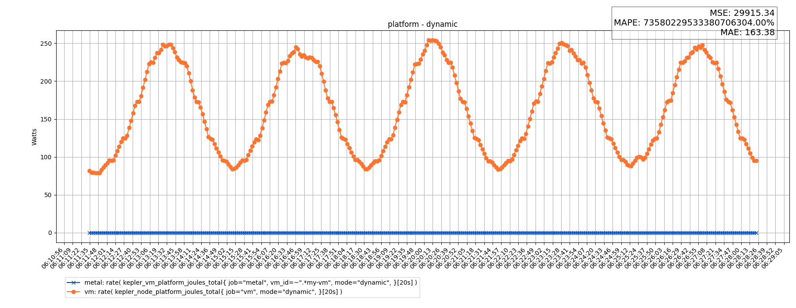
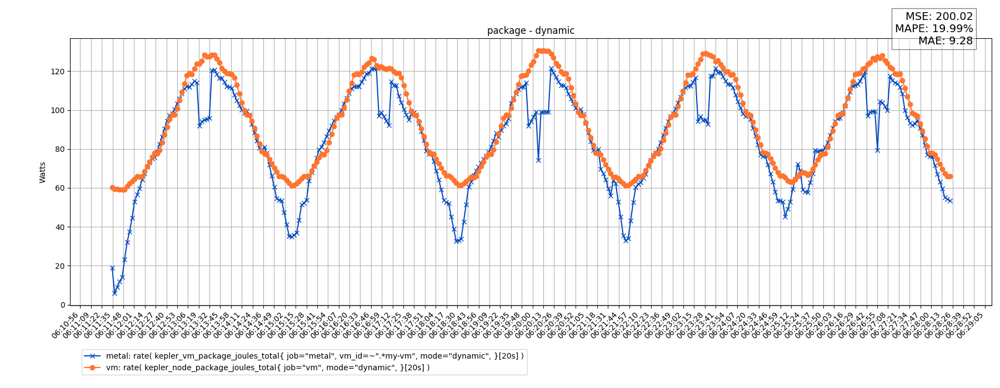
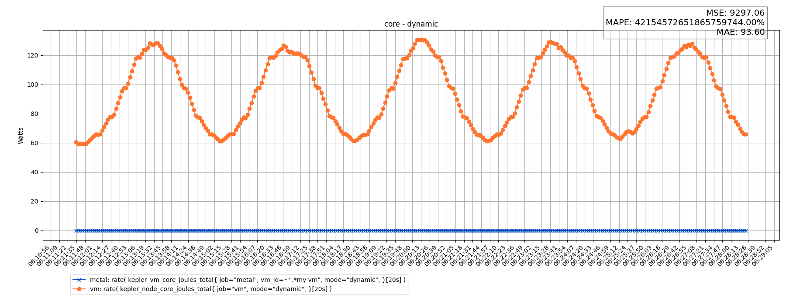
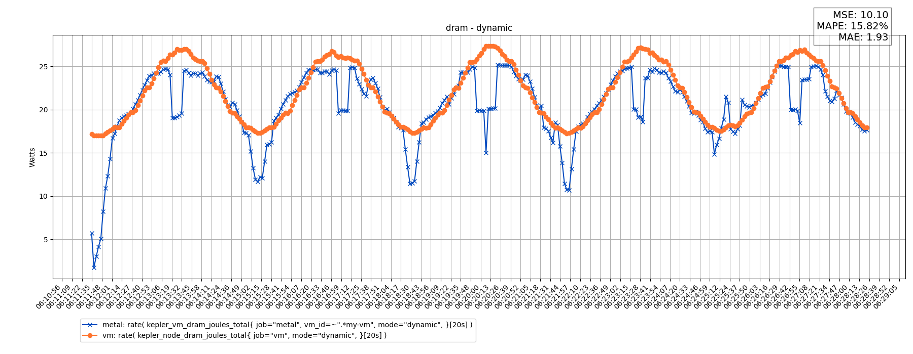
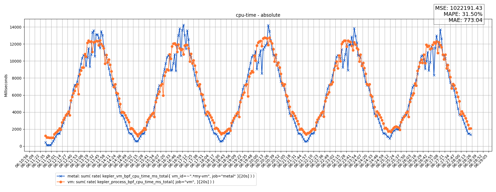

# v0.7.12-35-g82dc44ac

## Build Info

   - `kepler_exporter_build_info{arch="amd64", branch="main", instance="localhost:8888", job="metal", os="linux", revision="82dc44acf665fe117230e8a735e9b2ff827275a7", version="v0.7.12-35-g82dc44ac"}`
   - `kepler_exporter_build_info{arch="amd64", branch="main", instance="localhost:9999", job="vm", os="linux", revision="82dc44acf665fe117230e8a735e9b2ff827275a7", version="v0.7.12-35-g82dc44ac"}`
## Node Info

   - `kepler_node_info{components_power_source="rapl-sysfs", cpu_architecture="Broadwell", instance="localhost:8888", job="metal", platform_power_source="acpi", source="os"}`
   - `kepler_node_info{components_power_source="estimator", cpu_architecture="Broadwell", instance="localhost:9999", job="vm", platform_power_source="none", source="os"}`
## Machine Specs

### Host

| Model | Sockets | Cores | Threads | Flags |
| --- | --- | --- | --- | --- |
| Intel(R) Xeon(R) CPU E5-2686 v4 @ 2.30GHz | 2 | 72 | 2 | `fpu vme de pse tsc msr pae mce cx8 apic sep mtrr pge mca cmov pat pse36 clflush dts acpi mmx fxsr sse sse2 ss ht tm pbe syscall nx pdpe1gb rdtscp lm constant_tsc arch_perfmon pebs bts rep_good nopl xtopology nonstop_tsc cpuid aperfmperf pni pclmulqdq dtes64 monitor ds_cpl vmx smx est tm2 ssse3 sdbg fma cx16 xtpr pdcm pcid dca sse4_1 sse4_2 x2apic movbe popcnt tsc_deadline_timer aes xsave avx f16c rdrand lahf_lm abm 3dnowprefetch cpuid_fault epb cat_l3 cdp_l3 pti intel_ppin ssbd ibrs ibpb stibp tpr_shadow flexpriority ept vpid ept_ad fsgsbase tsc_adjust bmi1 hle avx2 smep bmi2 erms invpcid rtm cqm rdt_a rdseed adx smap intel_pt xsaveopt cqm_llc cqm_occup_llc cqm_mbm_total cqm_mbm_local dtherm ida arat pln pts vnmi md_clear flush_l1d` |

### VM

| Model | Sockets | Cores | Threads | Flags |
| --- | --- | --- | --- | --- |
| Intel(R) Xeon(R) CPU E5-2686 v4 @ 2.30GHz | 14 | 14 | 1 | `fpu vme de pse tsc msr pae mce cx8 apic sep mtrr pge mca cmov pat pse36 clflush mmx fxsr sse sse2 ss syscall nx pdpe1gb rdtscp lm constant_tsc arch_perfmon rep_good nopl xtopology cpuid tsc_known_freq pni pclmulqdq vmx ssse3 fma cx16 pdcm pcid sse4_1 sse4_2 x2apic movbe popcnt tsc_deadline_timer aes xsave avx f16c rdrand hypervisor lahf_lm abm 3dnowprefetch cpuid_fault pti ssbd ibrs ibpb stibp tpr_shadow flexpriority ept vpid ept_ad fsgsbase tsc_adjust bmi1 hle avx2 smep bmi2 erms invpcid rtm rdseed adx smap xsaveopt arat vnmi umip md_clear flush_l1d arch_capabilities` |

## Validation Results

   - Started At: `2024-11-12 06:11:34.768181`
   - Ended   At: `2024-11-12 06:28:23.476259`
   - Duration  : `0:16:48.708078`
## Validations

### Summary

| Name | MSE | MAPE | MAE | Pass / Fail |
| --- | --- | --- | --- | --- |
| [node-rapl - kepler-package](#node-rapl---kepler-package) | 5.30 | 1.55 | 1.37 | PASS |
| [platform - absolute](#platform---absolute) | 29915.34 | 73580229533380706304.00 | 163.38 | PASS |
| [package - absolute](#package---absolute) | 200.02 | 19.99 | 9.28 | PASS |
| [core - absolute](#core---absolute) | 9297.06 | 42154572651865759744.00 | 93.60 | PASS |
| [platform - dynamic](#platform---dynamic) | 29915.34 | 73580229533380706304.00 | 163.38 | PASS |
| [package - dynamic](#package---dynamic) | 200.02 | 19.99 | 9.28 | PASS |
| [core - dynamic](#core---dynamic) | 9297.06 | 42154572651865759744.00 | 93.60 | PASS |
| [dram - dynamic](#dram---dynamic) | 10.10 | 15.82 | 1.93 | PASS |
| [cpu-time - absolute](#cpu-time---absolute) | 1022191.43 | 31.50 | 773.04 | PASS |

### Details

#### node-rapl - kepler-package

**Queries**:
   - Actual  (node-rapl) : [`sum( rate( node_rapl_package_joules_total[20s] ) )`](artifacts/node-rapl-node_rapl_package_joules_total--absolute.json)
   - Predicted (kepler-package) : [`sum( rate( kepler_node_package_joules_total{ job="metal", }[20s] ) )`](artifacts/kepler-package-kepler_node_package_joules_total--absolute.json)

**Results**:
   - MSE  : `5.30`
   - MAPE : `1.55 %`
   - MAE  : `1.37`

**Charts**:

#### platform - absolute

**Queries**:
   - Actual  (metal) : [`sum( rate( kepler_vm_platform_joules_total{ job="metal", vm_id=~".*my-vm", }[20s] ) )`](artifacts/metal-kepler_vm_platform_joules_total--absolute.json)
   - Predicted (vm) : [`sum( rate( kepler_node_platform_joules_total{ job="vm", }[20s] ) )`](artifacts/vm-kepler_node_platform_joules_total--absolute.json)

**Results**:
   - MSE  : `29915.34`
   - MAPE : `73580229533380706304.00 %`
   - MAE  : `163.38`

**Charts**:

#### package - absolute

**Queries**:
   - Actual  (metal) : [`sum( rate( kepler_vm_package_joules_total{ job="metal", vm_id=~".*my-vm", }[20s] ) )`](artifacts/metal-kepler_vm_package_joules_total--absolute.json)
   - Predicted (vm) : [`sum( rate( kepler_node_package_joules_total{ job="vm", }[20s] ) )`](artifacts/vm-kepler_node_package_joules_total--absolute.json)

**Results**:
   - MSE  : `200.02`
   - MAPE : `19.99 %`
   - MAE  : `9.28`

**Charts**:

#### core - absolute

**Queries**:
   - Actual  (metal) : [`sum( rate( kepler_vm_core_joules_total{ job="metal", vm_id=~".*my-vm", }[20s] ) )`](artifacts/metal-kepler_vm_core_joules_total--absolute.json)
   - Predicted (vm) : [`sum( rate( kepler_node_core_joules_total{ job="vm", }[20s] ) )`](artifacts/vm-kepler_node_core_joules_total--absolute.json)

**Results**:
   - MSE  : `9297.06`
   - MAPE : `42154572651865759744.00 %`
   - MAE  : `93.60`

**Charts**:

#### platform - dynamic

**Queries**:
   - Actual  (metal) : [`rate( kepler_vm_platform_joules_total{ job="metal", vm_id=~".*my-vm", mode="dynamic", }[20s] )`](artifacts/metal-kepler_vm_platform_joules_total--dynamic.json)
   - Predicted (vm) : [`rate( kepler_node_platform_joules_total{ job="vm", mode="dynamic", }[20s] )`](artifacts/vm-kepler_node_platform_joules_total--dynamic.json)

**Results**:
   - MSE  : `29915.34`
   - MAPE : `73580229533380706304.00 %`
   - MAE  : `163.38`

**Charts**:

#### package - dynamic

**Queries**:
   - Actual  (metal) : [`rate( kepler_vm_package_joules_total{ job="metal", vm_id=~".*my-vm", mode="dynamic", }[20s] )`](artifacts/metal-kepler_vm_package_joules_total--dynamic.json)
   - Predicted (vm) : [`rate( kepler_node_package_joules_total{ job="vm", mode="dynamic", }[20s] )`](artifacts/vm-kepler_node_package_joules_total--dynamic.json)

**Results**:
   - MSE  : `200.02`
   - MAPE : `19.99 %`
   - MAE  : `9.28`

**Charts**:

#### core - dynamic

**Queries**:
   - Actual  (metal) : [`rate( kepler_vm_core_joules_total{ job="metal", vm_id=~".*my-vm", mode="dynamic", }[20s] )`](artifacts/metal-kepler_vm_core_joules_total--dynamic.json)
   - Predicted (vm) : [`rate( kepler_node_core_joules_total{ job="vm", mode="dynamic", }[20s] )`](artifacts/vm-kepler_node_core_joules_total--dynamic.json)

**Results**:
   - MSE  : `9297.06`
   - MAPE : `42154572651865759744.00 %`
   - MAE  : `93.60`

**Charts**:

#### dram - dynamic

**Queries**:
   - Actual  (metal) : [`rate( kepler_vm_dram_joules_total{ job="metal", vm_id=~".*my-vm", mode="dynamic", }[20s] )`](artifacts/metal-kepler_vm_dram_joules_total--dynamic.json)
   - Predicted (vm) : [`rate( kepler_node_dram_joules_total{ job="vm", mode="dynamic", }[20s] )`](artifacts/vm-kepler_node_dram_joules_total--dynamic.json)

**Results**:
   - MSE  : `10.10`
   - MAPE : `15.82 %`
   - MAE  : `1.93`

**Charts**:

#### cpu-time - absolute

**Queries**:
   - Actual  (metal) : [`sum( rate( kepler_vm_bpf_cpu_time_ms_total{ vm_id=~".*my-vm", job="metal" }[20s] ) )`](artifacts/metal-kepler_vm_bpf_cpu_time_ms_total--absolute.json)
   - Predicted (vm) : [`sum( rate( kepler_process_bpf_cpu_time_ms_total{ job="vm", }[20s] ) )`](artifacts/vm-kepler_process_bpf_cpu_time_ms_total--absolute.json)

**Results**:
   - MSE  : `1022191.43`
   - MAPE : `31.50 %`
   - MAE  : `773.04`

**Charts**:

