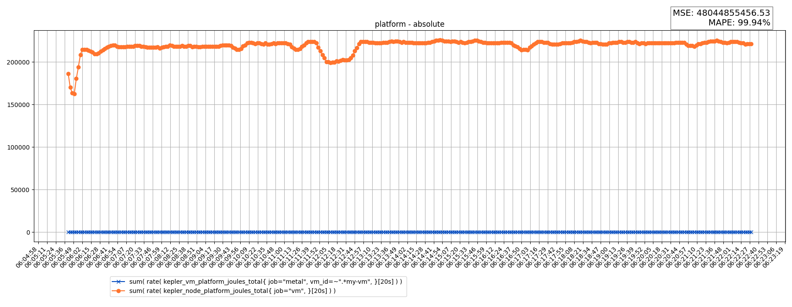
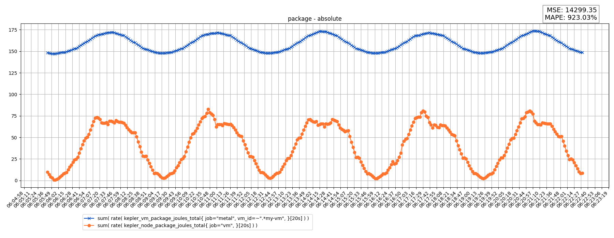
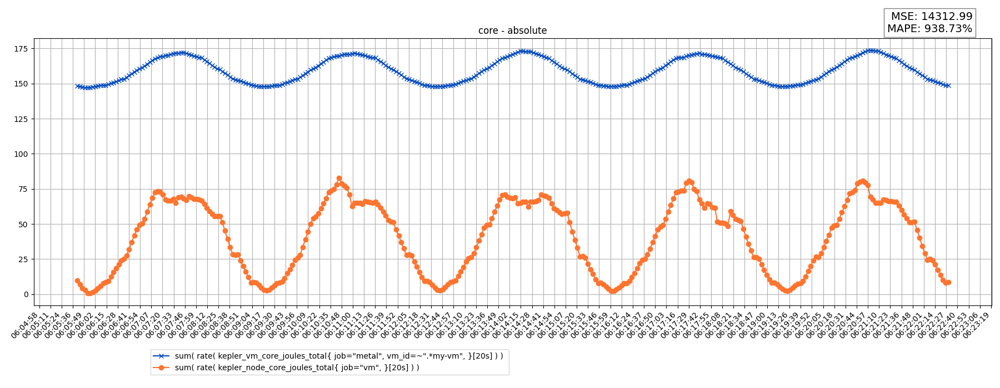
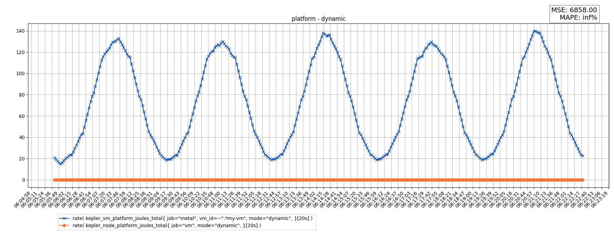
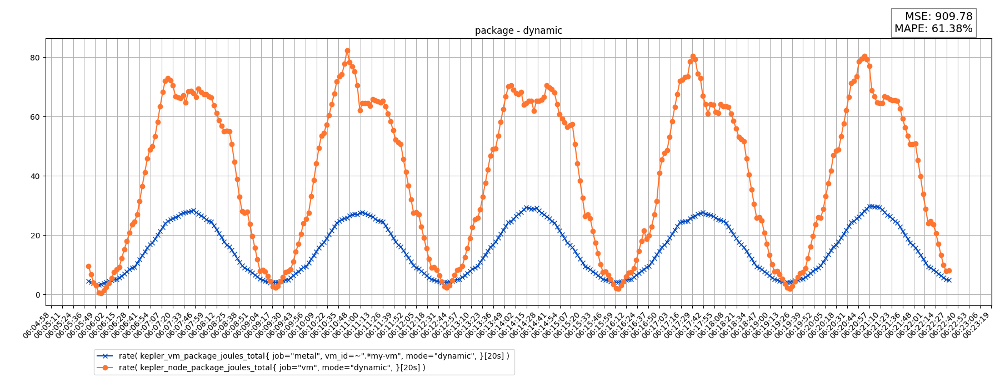
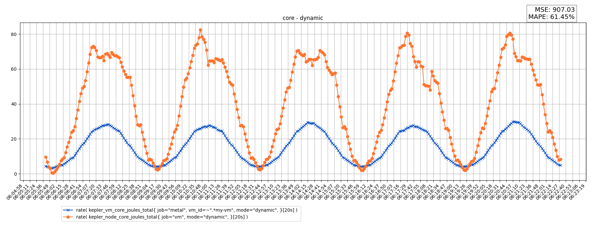
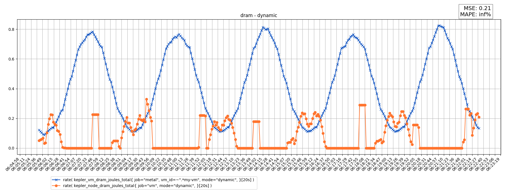
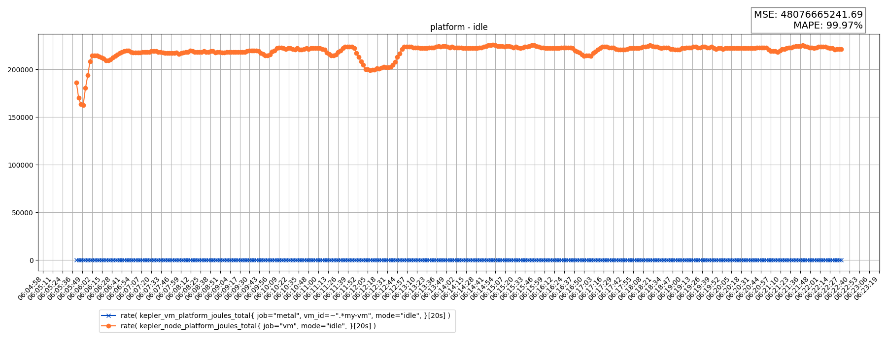
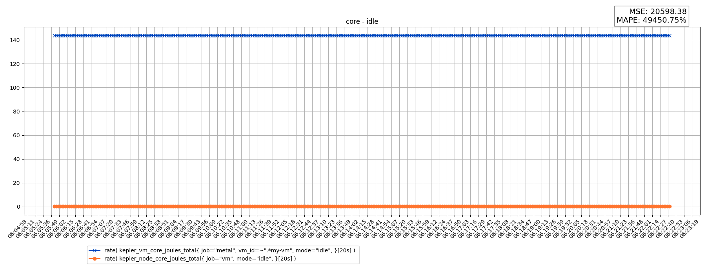
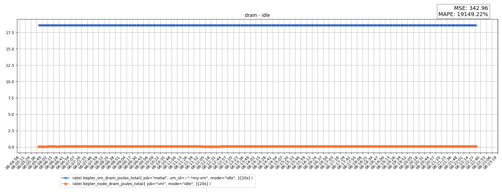

# v0.7.11-196-g6a76bc35

## Build Info

   - `kepler_exporter_build_info{arch="amd64", branch="main", instance="localhost:8888", job="metal", os="linux", revision="6a76bc358e568575f8ceba94c8aef6aed26b013d", version="v0.7.11-196-g6a76bc35-dirty"}`
   - `kepler_exporter_build_info{arch="amd64", branch="main", instance="localhost:9999", job="vm", os="linux", revision="6a76bc358e568575f8ceba94c8aef6aed26b013d", version="v0.7.11-196-g6a76bc35-dirty"}`
## Node Info

   - `kepler_node_info{components_power_source="rapl-sysfs", cpu_architecture="Coffee Lake", instance="localhost:8888", job="metal", platform_power_source="acpi", source="os"}`
   - `kepler_node_info{components_power_source="estimator", cpu_architecture="Coffee Lake", instance="localhost:9999", job="vm", platform_power_source="none", source="os"}`
## Machine Specs

### Host

| Model | Sockets | Cores | Threads | Flags |
| --- | --- | --- | --- | --- |
| Intel(R) Xeon(R) E-2278G CPU @ 3.40GHz | 1 | 16 | 2 | `fpu vme de pse tsc msr pae mce cx8 apic sep mtrr pge mca cmov pat pse36 clflush dts acpi mmx fxsr sse sse2 ss ht tm pbe syscall nx pdpe1gb rdtscp lm constant_tsc art arch_perfmon pebs bts rep_good nopl xtopology nonstop_tsc cpuid aperfmperf pni pclmulqdq dtes64 monitor ds_cpl vmx smx est tm2 ssse3 sdbg fma cx16 xtpr pdcm pcid sse4_1 sse4_2 x2apic movbe popcnt tsc_deadline_timer aes xsave avx f16c rdrand lahf_lm abm 3dnowprefetch cpuid_fault epb ssbd ibrs ibpb stibp ibrs_enhanced tpr_shadow flexpriority ept vpid ept_ad fsgsbase tsc_adjust bmi1 avx2 smep bmi2 erms invpcid mpx rdseed adx smap clflushopt intel_pt xsaveopt xsavec xgetbv1 xsaves dtherm ida arat pln pts hwp hwp_notify hwp_act_window hwp_epp vnmi md_clear flush_l1d arch_capabilities` |
### VM

| Model | Sockets | Cores | Threads | Flags |
| --- | --- | --- | --- | --- |
| Intel(R) Xeon(R) E-2278G CPU @ 3.40GHz | 10 | 10 | 1 | `fpu vme de pse tsc msr pae mce cx8 apic sep mtrr pge mca cmov pat pse36 clflush mmx fxsr sse sse2 ss syscall nx pdpe1gb rdtscp lm constant_tsc arch_perfmon rep_good nopl xtopology cpuid tsc_known_freq pni pclmulqdq vmx ssse3 fma cx16 pdcm pcid sse4_1 sse4_2 x2apic movbe popcnt tsc_deadline_timer aes xsave avx f16c rdrand hypervisor lahf_lm abm 3dnowprefetch cpuid_fault ssbd ibrs ibpb stibp ibrs_enhanced tpr_shadow flexpriority ept vpid ept_ad fsgsbase tsc_adjust bmi1 avx2 smep bmi2 erms invpcid mpx rdseed adx smap clflushopt xsaveopt xsavec xgetbv1 xsaves arat vnmi umip md_clear flush_l1d arch_capabilities` |
## Validation Results

   - Started At: `2024-09-05 02:05:41.835369`
   - Ended   At: `2024-09-05 02:22:30.670515`
   - Duration  : `0:16:48.835146`
## Validations

### Summary

| Name | MSE | MAPE | Pass / Fail |
| --- | --- | --- | --- |
| platform - absolute | 48044855456.53 | 99.94 | PASS |
| package - absolute | 14299.35 | 923.03 | PASS |
| core - absolute | 14312.99 | 938.73 | PASS |
| platform - dynamic | 6858.00 | inf | PASS |
| package - dynamic | 909.78 | 61.38 | PASS |
| core - dynamic | 907.03 | 61.45 | PASS |
| dram - dynamic | 0.21 | inf | PASS |
| platform - idle | 48076665241.69 | 99.97 | PASS |
| package - idle | 20578.14 | 39774.03 | PASS |
| core - idle | 20598.38 | 49450.75 | PASS |
| dram - idle | 342.96 | 19149.22 | PASS |
### Details

#### platform - absolute

**Queries**:
   - Actual  : `sum( rate( kepler_vm_platform_joules_total{ job="metal", vm_id=~".*my-vm", }[20s] ) ) `
   - Expected: `sum( rate( kepler_node_platform_joules_total{ job="vm", }[20s] ) ) `

**Results**:
   - MSE  : `48044855456.53`
   - MAPE : `99.94 %`

**Charts**:

#### package - absolute

**Queries**:
   - Actual  : `sum( rate( kepler_vm_package_joules_total{ job="metal", vm_id=~".*my-vm", }[20s] ) ) `
   - Expected: `sum( rate( kepler_node_package_joules_total{ job="vm", }[20s] ) ) `

**Results**:
   - MSE  : `14299.35`
   - MAPE : `923.03 %`

**Charts**:

#### core - absolute

**Queries**:
   - Actual  : `sum( rate( kepler_vm_core_joules_total{ job="metal", vm_id=~".*my-vm", }[20s] ) ) `
   - Expected: `sum( rate( kepler_node_core_joules_total{ job="vm", }[20s] ) ) `

**Results**:
   - MSE  : `14312.99`
   - MAPE : `938.73 %`

**Charts**:

#### platform - dynamic

**Queries**:
   - Actual  : `rate( kepler_vm_platform_joules_total{ job="metal", vm_id=~".*my-vm", mode="dynamic", }[20s] ) `
   - Expected: `rate( kepler_node_platform_joules_total{ job="vm", mode="dynamic", }[20s] ) `

**Results**:
   - MSE  : `6858.00`
   - MAPE : `inf %`

**Charts**:

#### package - dynamic

**Queries**:
   - Actual  : `rate( kepler_vm_package_joules_total{ job="metal", vm_id=~".*my-vm", mode="dynamic", }[20s] ) `
   - Expected: `rate( kepler_node_package_joules_total{ job="vm", mode="dynamic", }[20s] ) `

**Results**:
   - MSE  : `909.78`
   - MAPE : `61.38 %`

**Charts**:

#### core - dynamic

**Queries**:
   - Actual  : `rate( kepler_vm_core_joules_total{ job="metal", vm_id=~".*my-vm", mode="dynamic", }[20s] ) `
   - Expected: `rate( kepler_node_core_joules_total{ job="vm", mode="dynamic", }[20s] ) `

**Results**:
   - MSE  : `907.03`
   - MAPE : `61.45 %`

**Charts**:

#### dram - dynamic

**Queries**:
   - Actual  : `rate( kepler_vm_dram_joules_total{ job="metal", vm_id=~".*my-vm", mode="dynamic", }[20s] ) `
   - Expected: `rate( kepler_node_dram_joules_total{ job="vm", mode="dynamic", }[20s] ) `

**Results**:
   - MSE  : `0.21`
   - MAPE : `inf %`

**Charts**:

#### platform - idle

**Queries**:
   - Actual  : `rate( kepler_vm_platform_joules_total{ job="metal", vm_id=~".*my-vm", mode="idle", }[20s] ) `
   - Expected: `rate( kepler_node_platform_joules_total{ job="vm", mode="idle", }[20s] ) `

**Results**:
   - MSE  : `48076665241.69`
   - MAPE : `99.97 %`

**Charts**:

#### package - idle

**Queries**:
   - Actual  : `rate( kepler_vm_package_joules_total{ job="metal", vm_id=~".*my-vm", mode="idle", }[20s] ) `
   - Expected: `rate( kepler_node_package_joules_total{ job="vm", mode="idle", }[20s] ) `

**Results**:
   - MSE  : `20578.14`
   - MAPE : `39774.03 %`

**Charts**:

#### core - idle

**Queries**:
   - Actual  : `rate( kepler_vm_core_joules_total{ job="metal", vm_id=~".*my-vm", mode="idle", }[20s] ) `
   - Expected: `rate( kepler_node_core_joules_total{ job="vm", mode="idle", }[20s] ) `

**Results**:
   - MSE  : `20598.38`
   - MAPE : `49450.75 %`

**Charts**:

#### dram - idle

**Queries**:
   - Actual  : `rate( kepler_vm_dram_joules_total{ job="metal", vm_id=~".*my-vm", mode="idle", }[20s] ) `
   - Expected: `rate( kepler_node_dram_joules_total{ job="vm", mode="idle", }[20s] ) `

**Results**:
   - MSE  : `342.96`
   - MAPE : `19149.22 %`

**Charts**:

